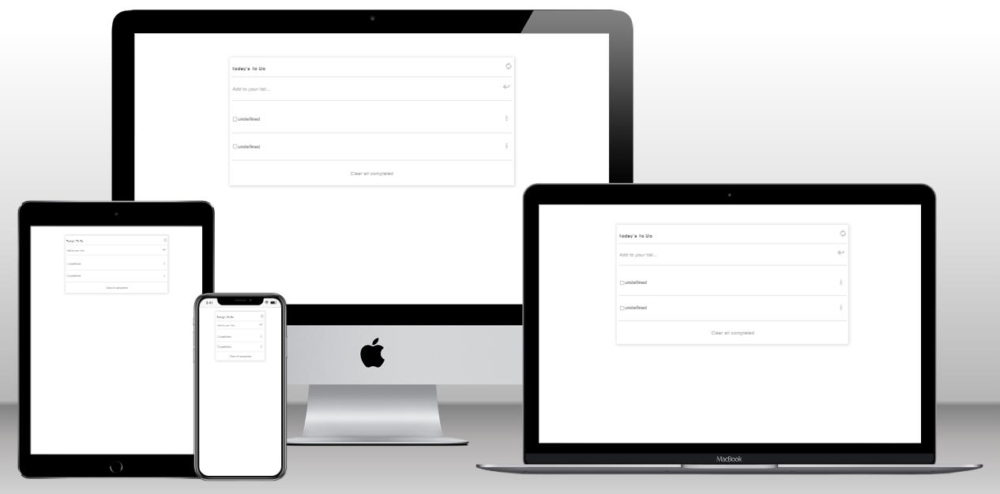

# To Do List

> This is a To-Do list app where a user can add or remove a task in a list & clear the list when all tasks are completed. Webpack has been used in this project.

## Built With

- Webpack
- HTML5
- CSS3
- JavaScript
- Git

## Preview



## Live Demo

[Live Demo Link from ./dist/index.html](https://chelmerrox.github.io/to-do-list/dist/)

## Getting Started

To get a local copy up and running follow these simple example steps.

### Prerequisites

- Webpack
- HTML5 & CSS3 
- JavaScript
- VSCode (or any other text editor)
- Git
- GitHub
- Command line/Terminal

### Setup

From the command line, do the following steps below:

1. Clone the projects' repository into your machine.

```bash
# Clone this repository
$ git clone git@github.com:chelmerrox/to-do-list.git

```
2. Change directory/Go into the repository with the command below.

```bash
$ cd to-do-list

```

3. Run this command.

```bash
$ npm run build

```

4. Run this to deploy the site on your local machine.

```bash
$ npm start

```

## Author

👤 **Losalini Rokocakau**

- GitHub: [@chelmerrox](https://github.com/chelmerrox)
- Twitter: [@chelmerrox](https://twitter.com/chelmerrox)
- LinkedIn: [Losalini Rokocakau](https://linkedin.com/in/losalini-rokocakau)

## 🤝 Contributing

Contributions, issues, and feature requests are welcome!

Feel free to check the [issues page](https://github.com/chelmerrox/to-do-list/issues).

## Show your support

Give a ⭐️ if you like this project!

## Acknowledgments

- My God & family
- Microverse
- Coding & Learning Partners: 
  1. [Habiburahman Payenda](https://github.com/HabibPayenda) 
  2. [Elie Harfouche](https://github.com/X-Elie-X) 
  3. [Ayesha Arshad](https://github.com/shella12) 
  4. [Eva L. Bucur](https://github.com/BucurEva87) 
- Morning Session Teams
- Stand-Up Teams
- Microverse TSEs

## 📝 License

This project is [MIT](./MIT.md) licensed.